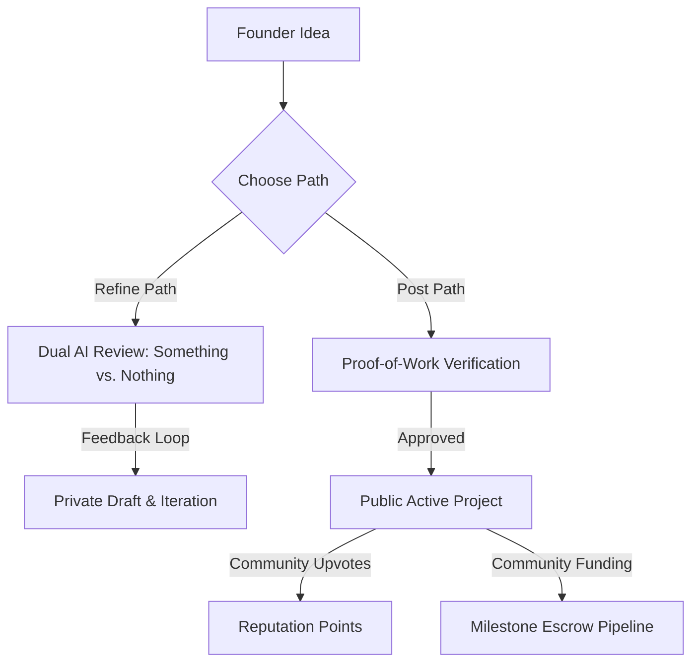
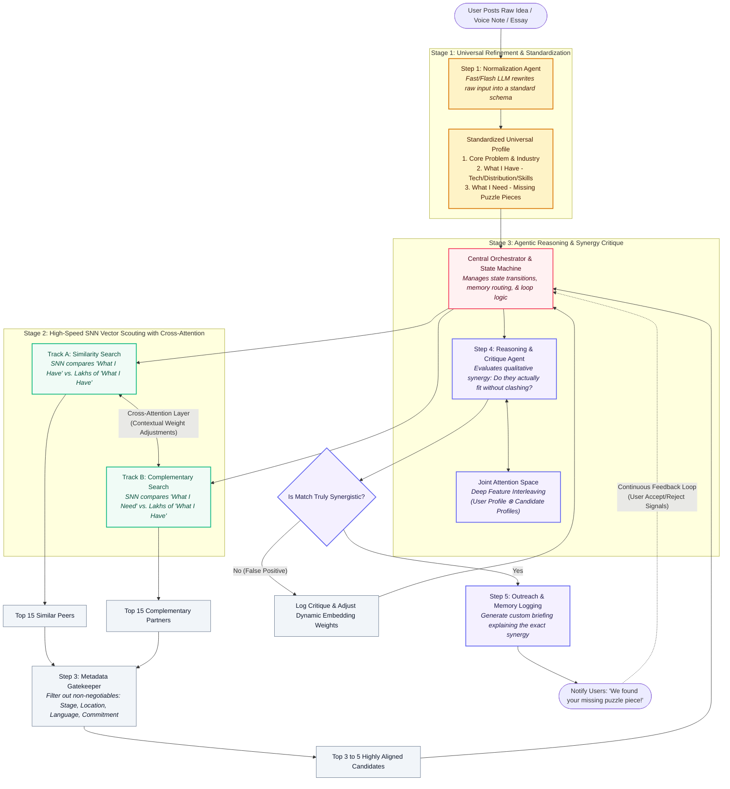

div align="center">
  <br/>

  <!-- Animated brand logo -->
  

  <h1 style="font-size: 30px; font-weight: 500; letter-spacing: -0.04em; color: #FFFFFF; font-family: -apple-system, BlinkMacSystemFont, sans-serif; margin-top: 10px; border-bottom: none; margin-bottom: 0;">something</h1>
  <p style="font-size: 10.5px; font-family: monospace; letter-spacing: 0.25em; text-transform: uppercase; color: rgba(255,255,255,0.35); margin-top: 6px; margin-bottom: 30px;">ideas find their people • capital finds its purpose</p>
</div>

---

## 1. Ideology & The Dual-Agent Model

The venture capital ecosystem is structurally optimized for **pitching**, not building. It values hyper-visibility over architectural truth. 

**Something** is an experimental development playground built to re-align this relationship. It introduces a dual-agent reasoning model that forces creators to challenge their conviction before requesting capital:

```
        SOMETHING [Belief Resonance] ────────┐
                                            ├─► CLARITY
        NOTHING [Doubt Stress-Test]  ───────┘
```

* **Something (The Operator / Belief)**: Maps emotional resonance, validates viral hooks, and maps lock-in loops using a local-first SQLite sync architecture.
* **Nothing (The Critic / Doubt)**: Stress-tests database scalability boundaries, computes adoption friction, and calculates user churn risks.

### The Indian Startup Bottleneck (Why This Matters)
- **The Team Formation Bottleneck**: CB Insights' postmortem analysis puts “not having the right team” at roughly **23.37% of startup failures**. In India, with over 55,234 startups receiving DPIIT recognition in FY26 (a 51.62% YoY jump), finding cofounders and builders remains network-restricted.
- **Capital-Discovery Friction**: Cold emails to VCs see a **95.93% non-reply rate**, while warm introductions convert **10–20x better**. Cold-sourced deals take twice as long to close, wasting runway.
- **Distribution Gap**: India has 164+ active angel networks and 700+ incubators, yet only **~5% of registered startups** raise funding. Access is gated by network-centric sourcing.

---

## 2. Platform Architecture & User Paths

Something replaces typical directories with verified, reputation-backed workflows.



### The Two Founder Paths
1. **Refine Path (Private & Free)**: Ideas go through private adversarial review from `Something` (validating belief/hooks) and `Nothing` (critiquing limits, economics, compliance, and churn risk) before anything goes public.
2. **Post Path (Public & Verified)**: Requires verifiable proof of work (such as a prototype, live product, signed pilot customer, patent filing, or press coverage) before listing. Presence on the platform is a signal of legitimacy.

### The Agentic Matching & Synergy Scouting Engine

Something implements a multi-stage, orchestrator-driven matching pipeline to connect founders with complementary partners and similar peers.



#### Pipeline Stages:
1. **Stage 1: Normalization & Standardization**: A fast LLM maps unstructured raw inputs into a schema covering the problem area, asset capabilities (*"What I Have"*), and resource needs (*"What I Need"*).
2. **Stage 2: SNN Vector Scouting**: Employs dual Similarity and Complementary vector search tracks with cross-attention weights to identify relevant candidate pools.
3. **Stage 3: Hard Metadata Gatekeeping**: Checks location, stage, commitment, and language requirements to filter results to the most viable matches.
4. **Stage 4: Strategic Synergy Critique**: A reasoning agent performs critique over candidate synergy in a Joint Attention Space. Success initiates custom briefing outreach, while mismatches feed back to adjust dynamic embedding weights.

---

## 3. Trust Infrastructure & Milestone Escrow

We replace standard checklists with a secure **Milestone Escrow Pipeline**:

```
[ Idea Posted ] ──► [ Community Pledges ] ──► [ Escrow Locked ]
                                                    │
[ Funds Released ] ◄── [ Committee Review ] ◄── [ Proof Submitted ]
```

1. **Escrow Lock**: Project capital is secured in milestone pools.
2. **Deliverable Submission**: Founders request payout releases by providing structured evidence logs (GitHub tags, test suites, live links, and work summaries).
3. **Review Board Verification**: Releases require approval from ≥ 50% of the active review committee members.

---

## 4. Technical Blueprint

The workspace is organized as a clean mono-repo separation between our Node reasoning core and the client interfaces:

```
Something/
├── backend/                  # Conviction API Core (Node.js & Express)
│   └── src/
│       ├── models/           # Mongoose schemas (Escrows, Users, Matches, Firms)
│       ├── utils/            # Calculation vectors, mail utilities
│       └── app.js            # Routing orchestration
│
├── frontend/                 # Client Workspace (Next.js 15 & React 19)
│   ├── app/
│   │   ├── founder/          # Founder workspaces (chats, funding, ideas, mutiny, problems)
│   │   ├── investor/         # Investor workspaces (investments, profile, settings, chats)
│   │   └── terms/            # Legal terms & conditions
│   │
│   ├── components/           # Radix UI shared primitives
│   ├── hooks/                # React utility hooks
│   └── lib/                  # State definitions, API clients & queries
│
└── README.md
```

### Frontend-Backend Integration & Axios Clients
The frontend communicates with the backend via three configurations:
- **Client A ([axios.ts](file:///Users/apple/Something/frontend/lib/axios.ts))**: Named `apiClient` instance with automatic JWT Authorization header injection and `401` interceptor redirection. Used for `/auth/*` endpoints.
- **Client B**: Raw `axios` concatenated with `NEXT_PUBLIC_API_BASE_URL` (for founder pages).
- **Client C**: Raw relative path `axios` calls (for investor pages), requiring Next.js rewrites or migration to `apiClient`.

---

## 5. Monetization Engine (The 6-Stream Model)

We monetize access to a verified network and crowd signals:

| Phase | Stream | Who Pays | Pricing Model |
| :--- | :--- | :--- | :--- |
| **At Validation** | Corporate Validation Sprints | Enterprise Product Teams | ₹3L – ₹5L per sprint |
| **At Validation** | Accelerator Cohort Access | Accelerators / Incubators | ₹1L – ₹2L/month retainer |
| **At Funding** | 1% Equity on Forwarded Pitch | Funded Founders | 1% equity on match |
| **At Funding** | 5% Escrow Take Rate | Successful Founders | 5% of GMV raised |
| **At Funding** | VC Scout Thesis Matching | VC Funds | ₹50K – ₹1.5L/month + success |
| **After Funding** | Verified Talent Placement | Hiring Companies | ₹1L – ₹3L per placement |
| **Recurring** | Premium Refine Tiers | Serious Founders (Builder/Studio) | ₹999 – ₹2,499/month |
| **Recurring** | Investor Subscriptions | Angels / VCs | ₹3,500 – ₹15,000/month |

---

## 6. Go-to-Market (GTM) Flywheel

Our user acquisition is divided into 5 phases with 10 specific plays:

* **Phase 1: Launch & Acquisition (M1–M3)**: Product Hunt launch, **The Warm Intro Machine** (curated fortnightly investor newsletter), **The Investors Are In** (live investor reactions to verified ideas), and **"The 5% Problem" Campaign** targeting un-funded startups.
* **Phase 2: The Competition (M3+)**: Gamified leaderboard where founders earn reputation points. Top 100 pitch; top 10 receive VC introductions.
* **Phase 3: The Content Engine (Ongoing)**: **The Nothing Report** (monthly analysis of anonymized critique data), **The Funded Idea Archive** (registry of success stories), and **Live Pitch Battle** videos.
* **Phase 4: Partnerships (M4–M8)**: University E-Cell integrations (IITB, IIITM Gwalior, BITS Pilani, SRMIST) and patent firm pipelines (referrals from Legalwiz, IndiaFilings, LexOrbis).
* **Phase 5: Influencer Program (Ongoing)**: Tiered rewards (cash + internship/offers) for creators based on referral metrics.

---

## 7. Visual Directives

The platform employs a dark-mode minimalist style, prioritizing spacious layouts over card boxes and borders:

* **Open Space**: Page headers use typography alignment with thin borders rather than rigid container frames.
* **Translucent Surfaces**: Elements use high backdrop blurs (`backdrop-blur-xl bg-white/[0.015] border-white/5`) to float over ambient background glow layers.
* **Equilibrium Indicators**: Duality ratings are balanced through minimal inline logs and simple text-link actions instead of generic SaaS button grids.

---

## 8. Getting Started

### Backend Core
```bash
# Navigate to backend
cd backend

# Install dependencies
npm install

# Run backend development server
npm run dev
```

### Frontend Workspace
```bash
# Navigate to frontend
cd frontend

# Install dependencies
npm install

# Start Next.js server
npm run dev
```

---

<div align="center">
  <p style="font-size: 10px; font-family: monospace; color: rgba(255,255,255,0.25);">ideas find their people.</p>
</div>
